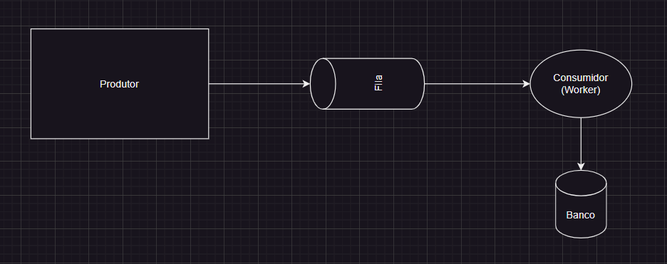

# Alterações

## Objetivo

Obter as estatistica de req/s x workers, de node.js e golang, (plotar um boxplot)

- req/s: quantidades de valores inseridos no banco de dados por segundo
- workers: quantidade de workers que consomem os valores da fila e inserem no banco de dados
  - node.js: quantidade de clusters rodando o Consumidor
  - golang: quantidade de goroutines rodando o Consumidor

## Arquitetura

Produtor: insere valor na fila/canal

Consumidor: consome valor da fila/canal e insere no banco de dados

## Script de teste

1. Valida se o banco ta ok
2. Executa o programa passando o numero de workers como argumento
3. fazer o dumb do banco de dados e salvar localmente com o nome do arquivo sendo [linguagem]-[workers]-[timestamp].sql

## Script de plot

1. ler os dados de cada arquivo
2. plotar o boxplot

## Tasks

1. Construir o código em node.js e golang
2. Construir o script para rodar o teste e gerar os resultados
